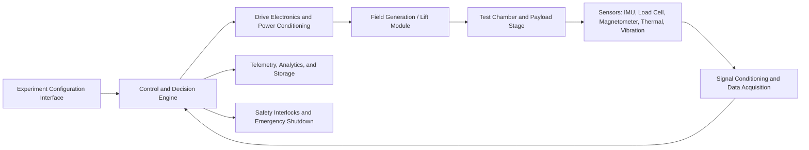

# Project Documentation

## 1. Title Page

- **Project Title:** Anti-Gravity Research and Demonstration System
- **Team Name:** [TO BE FILLED]
- **Team Members and their roles:** [TO BE FILLED]
- **Institution/Organization:** [TO BE FILLED]
- **Date of Submission:** [TO BE FILLED]

## 2. Abstract

The Anti-Gravity project is a research-oriented engineering initiative focused on investigating controlled lift, gravity compensation, and stable levitation through an integrated electromechanical and computational platform. In this document, the term "anti-gravity" is used as a project label for a system that seeks to counteract gravitational load through field-based actuation, dynamic stabilization, and precision control rather than as a claim of established gravitational inversion. The proposed system combines a high-energy actuation module, sensor-rich experimental chamber, real-time feedback controller, safety interlocks, and data analytics pipeline to evaluate candidate mechanisms under controlled conditions. The platform is designed to support theoretical modeling, subsystem simulation, prototype implementation, and iterative experimental validation. Core design goals include stability, repeatability, safety, energy-awareness, and transparent measurement of lift-related effects. The system also introduces a modular architecture so that different experimental principles, such as electromagnetic levitation, superconducting interactions, inertial compensation concepts, or hybrid field arrangements, can be tested without redesigning the full platform. This documentation presents the problem background, objectives, architecture, methodology, technology stack, practical applications, and future expansion path for the Anti-Gravity project.

## 3. Problem Statement

Gravity remains one of the most fundamental constraints in transportation, aerospace engineering, logistics, precision manufacturing, and human mobility. Most existing mobility systems rely on direct mechanical support or high-energy propulsion to overcome gravitational effects, which introduces limitations in fuel efficiency, wear, maintenance, payload flexibility, and operational safety. As a result, there is strong scientific and engineering interest in systems that can reduce effective gravitational load, enable controlled levitation, or improve vertical force management through advanced field interactions and closed-loop control.

Existing approaches such as magnetic levitation, air-cushion systems, superconducting suspension, and inertial stabilization each address part of the broader problem, but they often remain application-specific, infrastructure-dependent, or difficult to scale. In addition, many experimental efforts lack a unified platform for modeling, instrumentation, control, safety validation, and repeatable data collection.

The Anti-Gravity project addresses this gap by defining a structured research and prototype framework for investigating gravity-compensation concepts within a measurable, testable, and safety-governed environment. Solving this problem is important because it can contribute to future breakthroughs in advanced mobility, reduced-friction transport, sensitive payload handling, and next-generation propulsion research.

## 4. Objectives

1. To design and implement a modular anti-gravity research platform capable of evaluating controlled lift or gravity-compensation effects under measurable laboratory conditions.
2. To develop a closed-loop sensing, control, and safety framework that maintains platform stability while continuously monitoring force, field intensity, thermal behavior, and system integrity.
3. To generate experimentally traceable data that can be used to validate theoretical models, compare subsystem configurations, and guide future optimization or scale-up efforts.

## 5. Proposed Solution

The proposed solution is a multi-layer Anti-Gravity Research and Demonstration System consisting of a field-generation subsystem, structural test chamber, sensor and telemetry network, real-time control engine, power management unit, and data-driven analysis layer. The system is intended to serve as a controlled environment in which candidate gravity-compensation or levitation principles can be implemented, tested, and compared.

- **Overview of the system:** The platform accepts experimental configuration parameters, energizes the selected actuation subsystem, monitors platform response through multiple sensors, and applies adaptive control corrections to maintain stability. A supervisory software layer logs all events and produces analytical outputs for engineering review.
- **Key idea and approach:** The central idea is to combine high-energy actuation with dense instrumentation and real-time feedback so that any measured lift, force redistribution, or reduced apparent weight can be observed under controlled and repeatable conditions. Rather than depending on a single mechanism, the architecture supports multiple experimental modes, including electromagnetic levitation, superconducting field interaction, resonance-assisted stabilization, and hybrid control-assisted suspension concepts. The exact physical principle selected for the current prototype is [TO BE FILLED].
- **Innovation or uniqueness:** The novelty of the project lies in its modularity, measurement-first design, and integration of simulation, control, and safety in one platform. Unlike isolated levitation demonstrations, this system is designed as a configurable research framework with interchangeable actuation modules, a digital twin for pre-test analysis, and a formal methodology for comparing experimental outcomes across operating conditions.

## 6. System Architecture

The Anti-Gravity system follows a layered architecture in which actuation, sensing, control, analytics, and safety subsystems operate as coordinated modules.

- **High-level architecture diagram:**

**Figure 1.** Proposed high-level architecture of the Anti-Gravity Research and Demonstration System.

- **Description of components and their interactions:**
  - **Experiment Configuration Interface:** Used by researchers to define test profiles, target operating ranges, safety limits, and data logging parameters.
  - **Control and Decision Engine:** Executes the experiment logic, manages state transitions, applies feedback control, and coordinates subsystem timing.
  - **Drive Electronics and Power Conditioning:** Converts source power into the regulated electrical form required by coils, actuators, cryogenic interfaces, or auxiliary modules. The nominal voltage, current, and duty-cycle limits are [TO BE FILLED].
  - **Field Generation / Lift Module:** The primary experimental subsystem responsible for producing the physical conditions intended to reduce effective weight or generate lift. Its exact composition, such as coil geometry, superconducting components, rotating assemblies, or hybrid field structures, is [TO BE FILLED].
  - **Test Chamber and Payload Stage:** Mechanically isolates the test article, contains the experimental environment, and supports observation of displacement, force variation, or levitation stability.
  - **Sensor Suite:** Measures acceleration, apparent mass variation, displacement, magnetic field intensity, temperature, vibration, power consumption, and structural response.
  - **Signal Conditioning and Data Acquisition:** Filters raw sensor output, synchronizes timestamps, and publishes validated data to the control and analytics layers.
  - **Telemetry, Analytics, and Storage:** Stores time-series data, experimental metadata, and post-processed results for traceability and repeatability studies.
  - **Safety Interlocks and Emergency Shutdown:** Enforces hard operational limits to prevent overheating, electrical overload, unstable motion, or containment breach.

- **Data flow within the system:**
  1. The operator loads an experiment profile and validates pre-run safety conditions.
  2. The control engine initializes the power subsystem and activates the selected actuation mode.
  3. Sensor streams are continuously captured and transmitted to the acquisition layer.
  4. The control engine compares measured values against target conditions and safety thresholds.
  5. Corrective commands are issued to the drive electronics to maintain stability or terminate unsafe states.
  6. All telemetry, command states, and anomalies are stored for post-run analysis and model refinement.

## 7. Technology Stack

- **Frontend:** Monitoring and control dashboard for experiment setup, live telemetry visualization, and report generation using [TO BE FILLED].
- **Backend:** Real-time orchestration and experiment management layer using [TO BE FILLED], with interfaces for actuator control, safety logic, and telemetry processing.
- **Database:** A combination of time-series and relational storage, such as [TO BE FILLED], for sensor logs, experiment metadata, calibration records, and test reports.
- **APIs/Integrations:** Interfaces to power controllers, DAQ hardware, IMUs, magnetometers, thermal sensors, load cells, motion stages, and emergency shutdown relays using [TO BE FILLED].
- **Other Tools/Frameworks:** Finite element simulation, control-system modeling, and data science utilities such as MATLAB/Simulink, COMSOL Multiphysics, ANSYS, LabVIEW, ROS 2, Docker, Jupyter, and Git. The exact toolchain used in the current implementation is [TO BE FILLED].

## 8. Methodology and Implementation

The Anti-Gravity project follows a staged engineering methodology that links theoretical analysis, subsystem development, controlled experimentation, and iterative refinement.

- **Workflow/process**
  1. **Requirement Definition:** Establish target lift behavior, payload limits, operating envelope, safety constraints, and success criteria.
  2. **Theory Selection:** Identify the primary working principle for the prototype, such as electromagnetic levitation, superconducting suspension, inertial balancing, or a hybrid approach.
  3. **Model Development:** Build analytical and simulation models for force generation, field interaction, thermal loading, vibration response, and power demand.
  4. **Subsystem Design:** Develop the power unit, actuation module, mechanical frame, sensor network, and control electronics.
  5. **Prototype Fabrication and Integration:** Assemble hardware components and integrate them with the monitoring and control software stack.
  6. **Calibration:** Calibrate force sensors, inertial sensors, thermal probes, and reference instruments before every controlled test cycle.
  7. **Closed-Loop Testing:** Run experiments using defined operating profiles while the controller continuously updates actuation commands based on feedback.
  8. **Post-Run Analysis:** Compare observed behavior against predicted behavior, identify deviations, and update the model or hardware configuration.

- **Algorithms or models used**
  - Electromagnetic and force-field models to estimate lift potential, flux distribution, and actuator response.
  - Finite element analysis for structural, thermal, and magnetic field simulation.
  - State estimation methods, such as Kalman filtering or complementary filtering, for sensor fusion and noise reduction.
  - Control strategies, such as PID, adaptive control, or model predictive control, for maintaining stable operating conditions.
  - Fault detection logic for identifying thermal runaway, saturation, oscillatory instability, or abnormal force signatures.
  - Design of experiments methods for comparing parameter combinations, including excitation levels, coil spacing, payload mass, or chamber conditions.

- **Data handling (if applicable)**
  - Raw data from all sensors is timestamped, synchronized, and stored with experiment identifiers for traceability.
  - Signal preprocessing removes noise, compensates for drift, and flags invalid samples before analysis.
  - Derived metrics such as apparent mass reduction, stability index, energy efficiency, thermal gradient, and control effort are computed after each run.
  - Experimental results are versioned so that parameter sets, configurations, and outcomes can be reproduced and audited later.
  - Data retention, security, and backup procedures are [TO BE FILLED].

## 10. Use Cases and Challenges Resolution

- **Target users:**
  - Advanced propulsion researchers and aerospace engineering teams
  - University laboratories and multidisciplinary research groups
  - High-precision manufacturing and material-handling engineers
  - Defense and space-technology R&D organizations
  - Innovation teams developing low-contact transport or vibration-sensitive payload systems

- **Real-world scenarios where the solution can be applied**
  - Experimental validation of gravity-compensation concepts for future aerospace platforms
  - Low-contact movement of delicate components where friction and vibration must be minimized
  - Controlled levitation demonstrators for education, exhibitions, and proof-of-concept research
  - Precision positioning of sensitive equipment in environments where mechanical disturbance must be reduced
  - Development of digital twins and testbeds for field-based mobility and suspension systems

In addition to these use cases, the project directly addresses several major technical challenges. Stability is handled through closed-loop control and multi-sensor feedback. Safety is managed through hard interlocks, thermal monitoring, and automatic shutdown logic. Measurement uncertainty is reduced by calibration workflows, repeatable experiment profiles, and synchronized data acquisition. Scalability challenges are mitigated by using a modular architecture that allows higher-capacity actuation and improved control logic to be introduced without redesigning the entire platform.

## 11. Future Scope

- **Additional features**
  - Integration of advanced superconducting modules, cryogenic monitoring, or vacuum-assisted experimentation
  - AI-assisted parameter optimization for identifying stable operating points
  - Automated anomaly detection and experiment recommendation engines
  - Expanded visualization with digital twin playback and comparative run analytics
  - Remote experiment supervision and secure multi-user collaboration

- **Scalability improvements**
  - Multi-axis stabilization for larger payloads and more complex motion control
  - Higher-capacity power electronics and thermal-management systems
  - Distributed sensing with edge processing for faster control response
  - Standardized module interfaces for rapidly testing alternative lift-generation assemblies

- **Long-term vision**
  - Establish the platform as a validated anti-gravity and gravity-compensation research testbed
  - Transition from laboratory proof-of-concept toward application-specific demonstrators in aerospace, logistics, and precision engineering
  - Build a long-term knowledge base linking theory, simulation, experiment design, and measured system performance
  - Support future partnerships, publications, patents, and technology-transfer opportunities based on validated findings

## 12. Conclusion

- **Key achievements**
  - Defined a complete technical framework for an Anti-Gravity Research and Demonstration System
  - Structured the project around modular actuation, precise sensing, real-time control, and rigorous data analysis
  - Established a methodology that supports repeatable experimentation, safety governance, and model validation

- **Overall impact**
  - The project creates a disciplined engineering pathway for investigating gravity-compensation concepts in a measurable and transparent manner.
  - By combining hardware experimentation with software analytics and control, the system can accelerate learning cycles and reduce uncertainty in early-stage advanced mobility research.

- **Final remarks**
  - Anti-gravity remains an ambitious and experimentally challenging domain; however, the proposed system provides a practical foundation for structured investigation rather than uncontrolled speculation.
  - With the project-specific parameters, performance results, and implementation choices added, this documentation can serve as a formal technical record for academic review, engineering presentation, or research funding support.

## 13. References

1. Einstein, A. *The Foundation of the General Theory of Relativity*. Annalen der Physik, 1916.
2. Moon, F. C. *Superconducting Levitation: Applications to Bearings and Magnetic Transportation*. Wiley, 1994.
3. Astrom, K. J., and Murray, R. M. *Feedback Systems: An Introduction for Scientists and Engineers*. Princeton University Press, 2008.
4. Sadiku, M. N. O. *Elements of Electromagnetics*. [Edition and publication year TO BE FILLED].
5. Project-specific design calculations, test data, CAD models, and subsystem schematics. [TO BE FILLED].
6. Safety procedures, calibration records, and experimental validation reports. [TO BE FILLED].
