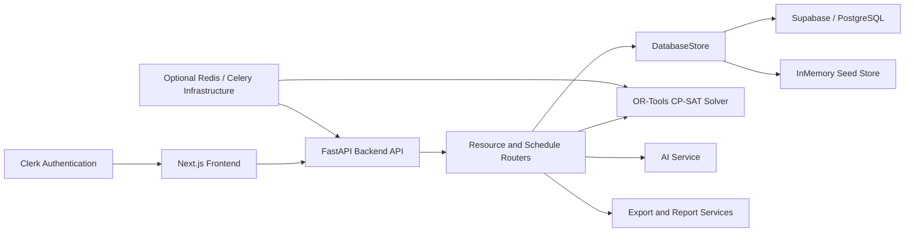

# Project Documentation

## 1. Title Page

- **Project Title:** TimeTable X: Intelligent Timetable Generator
- **Team Name:** [TO BE FILLED]
- **Team Members and their roles:** [TO BE FILLED]
- **Institution/Organization:** South Asian University
- **Date of Submission:** [TO BE FILLED]

## 2. Abstract

TimeTable X is a web-based academic scheduling workspace developed for South Asian University to support timetable generation, conflict review, schedule editing, reporting, and role-specific timetable access. The system addresses the operational difficulty of manually coordinating courses, faculty availability, rooms, sections, combined classes, holidays, and timetable constraints across multiple departments. The project combines a Next.js and React frontend with a FastAPI backend and a Google OR-Tools CP-SAT scheduling engine to generate draft timetables and expose them through an interactive administrative interface. The platform includes resource configuration pages, draft editing support, locked-slot preservation, explainable scheduling output, conflict resolution workflows, CSV/manual data import, report generation, and PDF/CSV export. The repository also includes optional integrations for Clerk-based authentication, Supabase-backed persistence, Redis and Celery infrastructure, and AI-assisted quality review and conflict prediction. A notable characteristic of the current implementation is its resilience: when live backend or database services are unavailable, the application can fall back to seeded in-memory data so that the system remains usable for demonstration and evaluation purposes.

## 3. Problem Statement

Academic timetable preparation is a high-effort and error-prone process when handled manually through spreadsheets or disconnected tools. University administrators must coordinate course loads, faculty availability, room capacity, room type requirements, section sizes, lunch windows, holiday blocks, combined sections, and version control while ensuring that no faculty member, room, or student cohort is double-booked.

The project files indicate that the current target environment is South Asian University, where multiple departments and semesters must be scheduled within a shared campus resource pool. Existing challenges include balancing theory and lab hours, assigning qualified faculty, handling practical sessions in specialized labs, maintaining compact student schedules, protecting manually locked decisions, and resolving conflicts before publication.

Without a structured scheduling platform, these tasks introduce delays, inconsistencies, and operational risk. A system that can automate draft timetable generation, expose conflicts and quality signals, preserve manual overrides, and support exports for faculty and students is therefore important for improving scheduling efficiency, transparency, and reliability.

## 4. Objectives

1. To provide an integrated scheduling workspace for configuring academic resources such as courses, faculty, rooms, sections, combined sections, timeslots, and holidays.
2. To automatically generate conflict-aware draft timetables using a constraint-based solver while preserving manually locked slots and supporting explainable schedule decisions.
3. To support review, correction, reporting, and publication workflows through conflict management, version history, AI-assisted insights, and timetable export capabilities.

## 5. Proposed Solution

TimeTable X proposes a full-stack timetable generation and scheduling workspace designed for university administrators, teachers, and students. The solution is centered on an administrative control interface backed by scheduling, reporting, and analysis services.

- **Overview of the system:** The frontend provides pages for dashboard monitoring, academic resource management, timetable editing, conflict review, reporting, history tracking, and role-based timetable views. The backend exposes REST endpoints for authentication, resource retrieval and mutation, timetable generation, conflict handling, reporting, imports, explainability, exports, and AI-assisted analysis.
- **Key idea and approach:** The key approach is to model timetable generation as a constrained optimization problem and solve it using Google OR-Tools CP-SAT. The generated output is then surfaced through review-oriented workflows, including conflict inspection, manual entry, locked-slot preservation, quality scoring, audit history, and schedule explanation. The project also uses graceful fallback behavior so that the system remains operational with seed data when live services are unavailable.
- **Innovation or uniqueness:** The repository combines several capabilities within one hackathon-ready platform: automated timetable generation, editable draft schedules, explainable scheduling output, conflict remediation, AI-assisted quality review, CSV/manual import with inferred constraint rules, and multi-role timetable views for administrators, teachers, and students. The current implementation also includes both demo-friendly in-memory behavior and extensibility toward Supabase, PostgreSQL, Redis, and Celery-backed deployment.

## 6. System Architecture

The project follows a layered web architecture with a React-based client, a FastAPI service layer, a scheduling engine, storage abstractions, and reporting and AI support modules.

- **High-level architecture diagram:**

**Figure 1.** High-level architecture derived from the project files.

- **Description of components and their interactions:**
  - **Frontend Layer:** Built with Next.js, React, and TypeScript. It renders the dashboard, configuration pages, draft editor, conflicts page, reports page, history page, and teacher/student dashboards.
  - **Authentication Layer:** Clerk middleware and provider components are integrated on the frontend. Role selection for demo use is stored locally and mapped to `ADMIN`, `TEACHER`, or `STUDENT`.
  - **API Layer:** FastAPI serves as the backend gateway. It includes routers for `auth`, `dashboard`, `resources`, `schedule`, `reports`, `export`, `import`, `explain`, and `ai`.
  - **Storage Layer:** The backend uses a `DatabaseStore` abstraction that can read from Supabase when configured and otherwise falls back to an in-memory seed dataset. This ensures demo resilience and a consistent contract for frontend services.
  - **Scheduling Engine:** The timetable generator is implemented in `backend/app/solver/engine.py` using Google OR-Tools CP-SAT. It builds requests from courses, sections, faculty, rooms, and timeslots, applies hard constraints, and writes generated entries back to the store.
  - **Job Execution Layer:** The active `/schedule/generate` endpoint uses an in-process background thread with an in-memory job tracker. The repository also includes Redis, Celery, and worker definitions for a more distributed execution model.
  - **AI and Explainability Layer:** The backend provides quality review, conflict prediction, chat assistance, and auto-rescheduling endpoints, along with an explainability endpoint that returns plain-language reasons for generated timetable placements.
  - **Reporting and Export Layer:** Report summary, version history, audit trail, and PDF/CSV export endpoints support downstream review and distribution.

- **Data flow within the system:**
  1. An administrator signs in, selects a demo role if required, and opens the dashboard.
  2. Resource data such as courses, faculty, rooms, sections, combined sections, timeslots, and holidays is fetched from the backend or fallback dataset.
  3. The administrator may upload CSV files or enter data manually, which updates the store and can generate additional constraint rules.
  4. When timetable generation is triggered, the backend creates a job entry and runs the OR-Tools solver in the background.
  5. The solver applies scheduling constraints, generates timetable entries, preserves locked slots, updates the draft version, and appends audit information.
  6. The frontend polls job status, reloads schedule entries after success, and presents conflicts, explanations, quality insights, and export actions.

## 7. Technology Stack

- **Frontend:** Next.js `15.5.15`, React `19`, TypeScript `5`, Tailwind CSS `4`, Clerk, Radix UI components, Lucide React, Recharts, React Hook Form, and TanStack React Query.
- **Backend:** Python `3.10+`, FastAPI, Uvicorn, Pydantic models, SQLAlchemy, Alembic, and Python Dotenv.
- **Database:** Supabase-backed tables are supported through the backend client and schema file; Docker Compose also provisions PostgreSQL. The current application code additionally uses an in-memory seeded fallback store when database access is not configured.
- **APIs/Integrations:** Clerk authentication, Supabase client access, REST communication between frontend and backend, CSV upload endpoints, PDF and CSV export endpoints, and an optional Groq-compatible chat completion API for AI-generated assistance.
- **Other Tools/Frameworks:** Google OR-Tools CP-SAT for timetable solving, Celery and Redis for asynchronous job infrastructure, ReportLab for PDF export, OpenPyXL for spreadsheet-related support, Docker, Docker Compose, and Procfile-based deployment support.

## 8. Methodology and Implementation

The repository implements timetable generation as a configurable academic workflow that combines resource modeling, constraint solving, review, and export.

- **Workflow/process**
  1. **Authentication and role selection:** Users enter the application through Clerk-based sign-in and, in demo mode, select an `ADMIN`, `TEACHER`, or `STUDENT` workspace role.
  2. **Resource setup:** Administrators review or modify departments, courses, faculty, rooms, sections, combined sections, timeslots, and holidays through resource pages or import mechanisms.
  3. **Data import:** CSV uploads are parsed on the backend, the appropriate collection is inferred from headers, and supported records are inserted or updated in the store. Manual form-based injection is also available for selected room, section, and course fields.
  4. **Constraint enrichment:** Imported data may produce additional constraint rules such as faculty maximum periods per day, unavailable slots, room restrictions, section restrictions, and holiday day blocking.
  5. **Timetable generation:** The frontend triggers `/schedule/generate`, and the backend starts a background job that invokes the OR-Tools solver.
  6. **Result persistence and review:** Generated entries are written back into the store, existing locked slots are preserved, version metadata is updated, and an audit entry is appended.
  7. **Conflict and explanation review:** Administrators inspect unresolved conflicts, suggested fixes, AI-assisted rescheduling options, and schedule explainability data.
  8. **Export and publication preparation:** The system provides report summaries, version history, audit trail access, and export actions for PDF and CSV timetable output.

- **Algorithms or models used**
  - A Google OR-Tools CP-SAT constraint model is used for timetable generation.
  - The solver constructs one scheduling request per required theory and practical hour per section.
  - Verified hard constraints in the code include:
    - Each request must be scheduled exactly once.
    - A room can host at most one request in a period.
    - A faculty member can teach at most one class in a period.
    - A section can attend at most one class in a period.
    - Room capacity must be greater than or equal to section size.
    - Lab sessions must be placed in `LAB` rooms and theory sessions in `CLASSROOM` rooms.
    - Faculty daily load must not exceed configured limits.
    - Practical sessions are scheduled in consecutive periods on the same day.
    - Holiday-blocked days and file-inferred unavailable slots are excluded from placement.
  - The solver also includes a soft objective related to reducing faculty idle gaps.
  - AI analysis features compute quality review and conflict prediction heuristics from current timetable, conflict, course, faculty, room, and section data.

- **Data handling (if applicable)**
  - The frontend uses typed service layers and fallback JSON retrieval so that mock data can be shown if live APIs fail.
  - The backend supports both Supabase-backed persistence and an in-memory fallback store populated from seed data.
  - CSV import validates file extension, content type, size, encoding, and headers before normalizing rows and inferring the target collection.
  - Imported rows are converted into canonical structures for rooms, faculty, sections, courses, or holidays, and inferred constraint rules are stored for future solver runs.
  - Export endpoints generate a ReportLab-based PDF and a CSV download from timetable entries.

## 10. Use Cases and Challenges Resolution

- **Target users:**
  - University scheduling administrators
  - Faculty members
  - Students

- **Real-world scenarios where the solution can be applied**
  - Generating draft academic timetables for multiple departments and semesters
  - Managing theory and lab scheduling under room capacity and room type constraints
  - Reviewing and resolving scheduling conflicts before final timetable publication
  - Preserving manual exceptions or locked institutional decisions during regeneration
  - Exporting timetable outputs for faculty circulation and section-wise student access

The project directly addresses several scheduling challenges visible in the codebase and seeded dataset. Room-capacity violations are surfaced through conflict records and constraint enforcement. Faculty overload is controlled through `maxPeriodsPerDay` rules and highlighted in AI quality review and conflict prediction. Lab scheduling complexity is handled through dedicated `LAB` room matching and consecutive practical-slot logic. Data incompleteness is mitigated through CSV/manual import support and fallback seed data. Finally, resilience challenges are reduced by allowing the frontend and backend to continue functioning when external services such as the API database are unavailable.

## 11. Future Scope

- **Additional features**
  - Production-grade identity and access control beyond the current demo role-selection flow
  - More advanced audit, persistence, and long-lived timetable history management
  - Expanded optimization beyond the current solver implementation and soft-gap objective
  - Broader AI-assisted scheduling support and deeper automatic remediation workflows

- **Scalability improvements**
  - Migration from the current in-process background job tracker to the Redis and Celery infrastructure already present in the repository
  - Stronger database-backed persistence using the provided Supabase/PostgreSQL schema
  - Multi-tenant institutional support, which is explicitly outside the current MVP scope

- **Long-term vision**
  - A scheduling command center that reduces timetable preparation time from manual multi-day work to guided generation and review
  - A transparent timetable platform where generated decisions, conflicts, versions, and exports are all managed in one system
  - A deployable academic scheduling workspace that can be extended beyond hackathon demonstration use

## 12. Conclusion

- **Key achievements**
  - The project delivers a full-stack academic timetable workspace with configuration, generation, conflict handling, editing, reporting, and export flows.
  - It integrates a constraint-based OR-Tools solver with a modern web interface and typed backend contracts.
  - It includes explainability, AI-assisted review, import support, version history, and resilient fallback behavior for demo continuity.

- **Overall impact**
  - TimeTable X addresses a real university scheduling problem by reducing manual coordination effort and making timetable generation more systematic, reviewable, and operationally safe.
  - The architecture is practical for hackathon delivery while remaining extensible toward more persistent and scalable deployment models.

- **Final remarks**
  - Based on the project folder, the system is already structured as a strong prototype for academic scheduling automation.
  - Fields such as team identity and formal submission metadata should be completed before final submission, but the technical content of the documentation is supported by the current repository contents.

## 13. References

1. `PROJECT_PRD.md`
2. `backend/README.md`
3. `arch.txt`
4. `package.json`
5. `backend/pyproject.toml`
6. `backend/requirements.txt`
7. `backend/app/main.py`
8. `backend/app/solver/engine.py`
9. `backend/app/routers/schedule.py`
10. `backend/app/routers/import_data.py`
11. `backend/app/ai_service.py`
12. `lib/config.ts`
13. `lib/mock-data.ts`
14. `supabase_schema.sql`
15. `docker-compose.yml`
