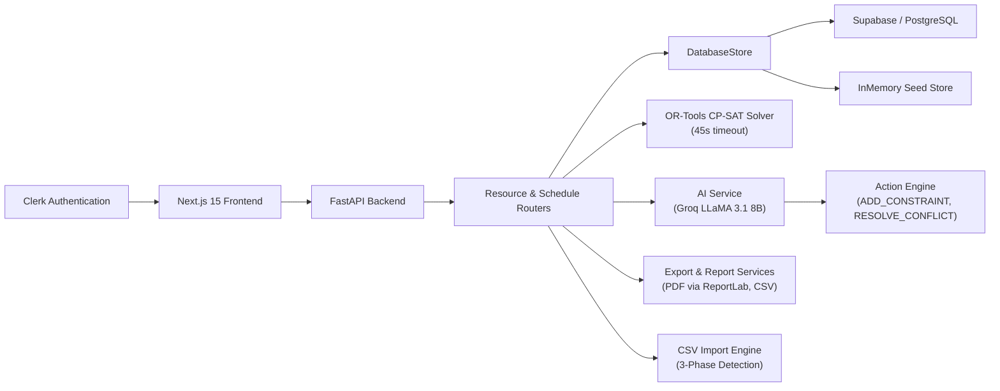

# Project Documentation

## 1. Title Page

- **Project Title:** TimeTable X: Intelligent Timetable Generator
- **Team Name:** [TO BE FILLED]
- **Team Members and their roles:** [TO BE FILLED]
- **Institution/Organization:** South Asian University
- **Date of Submission:** April 2026

## 2. Abstract

TimeTable X is a web-based academic scheduling workspace developed for South Asian University to automate timetable generation, conflict review, schedule editing, reporting, and role-specific timetable access. The system addresses the operational difficulty of manually coordinating courses, faculty availability, rooms, sections, combined classes, holidays, and timetable constraints across multiple departments. The project combines a Next.js 15 and React 19 frontend with a FastAPI backend and a Google OR-Tools CP-SAT (Constraint Programming – Satisfiability) scheduling engine to generate optimal draft timetables. The platform includes resource configuration pages, interactive draft editing with manual class assignment, locked-slot preservation, explainable scheduling output (XAI), conflict resolution workflows, AI-powered CSV/manual data import with flexible header recognition, report generation, and PDF/CSV export. The AI assistant is powered by Groq (LLaMA 3.1 8B) and can not only advise on scheduling decisions but also execute real-time actions such as adding constraints, resolving conflicts, and triggering regeneration. A notable characteristic of the implementation is its resilience: when live backend or database services are unavailable, the application falls back to seeded in-memory data so that the system remains fully usable for demonstration and evaluation purposes.

## 3. Problem Statement

Academic timetable preparation is a high-effort and error-prone process when handled manually through spreadsheets or disconnected tools. University administrators must coordinate course loads, faculty availability, room capacity, room type requirements, section sizes, lunch windows, holiday blocks, combined sections, and version control while ensuring that no faculty member, room, or student cohort is double-booked.

The current target environment is South Asian University, where multiple departments (CSE, ECE, ME) and semesters must be scheduled within a shared campus resource pool. Existing challenges include balancing theory and lab hours, assigning qualified faculty, handling practical sessions in specialized labs, maintaining compact student schedules, protecting manually locked decisions, and resolving conflicts before publication.

Without a structured scheduling platform, these tasks introduce delays, inconsistencies, and operational risk. TimeTable X provides a system that automates draft timetable generation, exposes conflicts and quality signals, preserves manual overrides, and supports exports — improving scheduling efficiency, transparency, and reliability.

## 4. Objectives

1. To provide an integrated scheduling workspace for configuring academic resources such as courses, faculty, rooms, sections, combined sections, timeslots, and holidays.
2. To automatically generate conflict-aware draft timetables using a constraint-based solver (Google OR-Tools CP-SAT) while preserving manually locked slots and supporting explainable schedule decisions.
3. To support review, correction, reporting, and publication workflows through conflict management, version history, AI-assisted insights, and timetable export capabilities.
4. To enable intelligent data import that can recognize and map non-standard CSV column names using a 3-phase detection system (strict matching → synonym matching → AI inference).
5. To provide an AI copilot that can not only advise but also execute scheduling actions (add constraints, resolve conflicts) in real-time.

## 5. Proposed Solution

TimeTable X proposes a full-stack timetable generation and scheduling workspace designed for university administrators, teachers, and students. The solution is centered on an administrative control interface backed by scheduling, reporting, and analysis services.

- **Overview of the system:** The frontend provides pages for dashboard monitoring, academic resource management, timetable editing with manual class assignment, conflict review, reporting, history tracking, and role-based timetable views. The backend exposes REST endpoints for authentication, resource retrieval and mutation, timetable generation (with background job tracking), conflict handling, reporting, imports, explainability, exports, and AI-assisted analysis with action execution.
- **Key idea and approach:** The key approach is to model timetable generation as a constrained optimization problem and solve it using Google OR-Tools CP-SAT with a 45-second solver timeout. The generated output is then surfaced through review-oriented workflows, including conflict inspection, manual entry, locked-slot preservation, quality scoring, audit history, and schedule explanation. The AI assistant can execute real-time scheduling actions through a structured `[ACTIONS]` protocol. CSV import uses a 3-phase detection system (strict headers → 50+ synonym aliases → Groq LLM inference) to handle varied column naming conventions.
- **Innovation or uniqueness:**
  - **AI Action Engine:** The AI copilot can physically modify the schedule by adding constraints, resolving conflicts, and logging audit entries — not just advise.
  - **3-Phase CSV Detection:** Uploads with unconventional headers (e.g., "Classroom Name" instead of "room_name") are automatically recognized via synonym dictionaries and AI inference.
  - **Explainable AI (XAI):** Every scheduled placement includes a human-readable reason explaining why that course was placed in that room at that time.
  - **Resilient Architecture:** The system operates seamlessly with or without Supabase, falling back to in-memory seed data.

## 6. System Architecture

The project follows a layered web architecture with a React-based client, a FastAPI service layer, a scheduling engine, storage abstractions, and AI support modules.

- **High-level architecture diagram:**

**Figure 1.** High-level architecture derived from the project files.

- **Description of components and their interactions:**
  - **Frontend Layer:** Built with Next.js 15, React 19, TypeScript 5, and Tailwind CSS 4. It renders the dashboard, configuration pages, draft editor with manual class assignment, conflicts page, reports page, history page, and teacher/student dashboards. Uses Radix UI primitives, Lucide React icons, and glassmorphism design language.
  - **Authentication Layer:** Clerk middleware and provider components handle sign-in. Role selection (`ADMIN`, `TEACHER`, `STUDENT`) is stored locally for demo flexibility.
  - **API Layer:** FastAPI serves as the backend gateway with routers for `auth`, `dashboard`, `resources`, `schedule`, `reports`, `export`, `import`, `explain`, and `ai`. Includes rate limiting middleware (with status polling exemption) and security headers.
  - **Storage Layer:** The `DatabaseStore` abstraction reads from Supabase when configured and falls back to an in-memory seed dataset. CamelCase/snake_case conversion is handled automatically.
  - **Scheduling Engine:** Implemented in `engine.py` using Google OR-Tools CP-SAT with a 45-second solver timeout. Constructs one scheduling request per required theory and practical hour per section. Implements 9 hard constraints and a soft objective for faculty gap minimization.
  - **AI Service Layer:** Powered by Groq (LLaMA 3.1 8B Instant). Provides quality review, conflict prediction, chat assistance, and an **Action Engine** that can execute structured side-effects (`ADD_CONSTRAINT`, `RESOLVE_CONFLICT`, `TRIGGER_GENERATE`, `ADD_AUDIT`). All AI actions are logged to the audit trail.
  - **CSV Import Engine:** Uses a 3-phase detection system: (1) strict header matching, (2) synonym-based matching with 50+ aliases across rooms, faculty, sections, courses, and holidays, (3) AI-powered schema detection via Groq LLM. Returns both the collection type and a column mapping dictionary.
  - **Constraint Inference Engine:** Automatically extracts scheduling constraints from imported data, including `faculty_max_periods_per_day`, `faculty_unavailable_slot`, `room_unavailable_slot`, `section_unavailable_slot`, `course_required_room`, and `holiday_block_day`.
  - **Reporting and Export Layer:** Report summary, version history, audit trail, and PDF (ReportLab) / CSV export endpoints.

- **Data flow within the system:**
  1. An administrator signs in via Clerk, selects a role, and opens the dashboard.
  2. Resource data (courses, faculty, rooms, sections, etc.) is fetched from the backend or fallback dataset.
  3. The administrator uploads CSV files (with any naming convention) or enters data manually. The import engine detects the entity type, maps columns, and infers constraint rules.
  4. When timetable generation is triggered, the backend creates a background job and runs the OR-Tools CP-SAT solver (45s timeout).
  5. The solver applies 9 hard constraints, generates timetable entries, preserves locked slots, updates the draft version, and appends audit information.
  6. The frontend polls job status (exempt from rate limiting), reloads schedule entries, and presents conflicts, explanations, quality insights, and export actions.
  7. The AI Chat can be used to ask questions or execute scheduling actions (e.g., "Block P1 on Monday for Dr. Sharma").

## 7. Technology Stack

- **Frontend:** Next.js `15.5.15`, React `19`, TypeScript `5`, Tailwind CSS `4.1.9`, Clerk (authentication), Radix UI components, Lucide React (icons), Recharts (charts), React Hook Form, and TanStack React Query.
- **Backend:** Python `3.10+`, FastAPI `0.115.6`, Uvicorn `0.34.0`, Pydantic v2 models, SQLAlchemy `2.0.36`, Alembic `1.14.1`, and Python Dotenv `1.0.1`.
- **Database:** Supabase `2.11.0` with PostgreSQL; Docker Compose provisioning available. In-memory seeded fallback store for demo resilience.
- **Solver Engine:** Google OR-Tools `9.11.4210` (CP-SAT constraint programming solver).
- **AI/LLM:** Groq API with LLaMA 3.1 8B Instant model for chat assistance, quality review, conflict prediction, action execution, and CSV schema detection.
- **APIs/Integrations:** Clerk authentication, Supabase client, REST communication between frontend and backend, CSV upload with 3-phase header detection, PDF export (ReportLab `4.2.5`), Excel support (OpenPyXL `3.1.5`).
- **Infrastructure:** Docker, Docker Compose, Celery `5.4.0`, Redis `5.2.1` for asynchronous job support, Procfile-based deployment (Render), Vercel for frontend hosting.

## 8. Methodology and Implementation

The repository implements timetable generation as a configurable academic workflow that combines resource modeling, constraint solving, AI-powered review, and export.

- **Workflow/process**
  1. **Authentication and role selection:** Users sign in through Clerk and select an `ADMIN`, `TEACHER`, or `STUDENT` workspace role.
  2. **Resource setup:** Administrators review or modify departments, courses, faculty, rooms, sections, combined sections, timeslots, and holidays through resource pages.
  3. **Data import:** CSV uploads are parsed, headers are normalized to snake_case, and the entity type is detected via a 3-phase system (strict → synonym → AI). Supported column aliases include "Classroom Name", "Hall Capacity", "Teacher", "Batch", "Subject Code", etc. Manual form-based entry is also available.
  4. **Constraint enrichment:** Imported data produces constraint rules: `faculty_max_periods_per_day`, `faculty_unavailable_slot`, `room_unavailable_slot`, `section_unavailable_slot`, `course_required_room`, and `holiday_block_day`. Text columns like "notes" and "remarks" are also parsed for natural-language scheduling hints.
  5. **Timetable generation:** The frontend triggers `/schedule/generate`, and the backend runs the OR-Tools CP-SAT solver in a background thread with a 45-second timeout.
  6. **Result persistence and review:** Generated entries are written to the store, locked slots are preserved, version metadata is updated, and audit entries are appended.
  7. **Conflict and explanation review:** Administrators inspect conflicts, suggested fixes, AI-assisted rescheduling, and XAI explanations for each placement.
  8. **AI Chat actions:** The AI copilot can execute real scheduling changes when asked, including adding constraints, resolving conflicts, and triggering regeneration. All actions are logged in the audit trail.
  9. **Export and publication:** Report summaries, version history, audit trail access, and PDF/CSV export for distribution.

- **Algorithms and models used**
  - **Solver:** Google OR-Tools CP-SAT constraint model with 45-second timeout.
  - The solver constructs one scheduling request per required theory and practical hour per section.
  - **9 Hard Constraints:**
    1. Each request must be scheduled exactly once.
    2. A room can host at most one request in a period.
    3. A faculty member can teach at most one class in a period.
    4. A section can attend at most one class in a period.
    5. Room capacity must be ≥ section student count.
    6. Lab sessions must be placed in `LAB` rooms; theory sessions in `CLASSROOM` rooms.
    7. Faculty daily load must not exceed configured `maxPeriodsPerDay`.
    8. Practical sessions are scheduled in consecutive periods on the same day.
    9. Holiday-blocked days and file-inferred unavailable slots are excluded from placement.
  - **Soft Objective:** Minimize faculty idle gaps between assigned periods.
  - **AI Analysis:** Quality review scoring and conflict prediction heuristics from timetable, course, faculty, room, and section data.
  - **AI Action Protocol:** The LLM generates structured `[ACTIONS]` JSON blocks containing `ADD_CONSTRAINT`, `RESOLVE_CONFLICT`, `TRIGGER_GENERATE`, or `ADD_AUDIT` commands that are parsed and executed by the backend.

- **Data handling**
  - The frontend uses typed service layers with graceful fallback to mock data if the API is unreachable (12-second timeout).
  - The backend supports Supabase-backed persistence with automatic CamelCase/snake_case conversion, plus an in-memory fallback store.
  - CSV import validates file extension, content type, size (5MB max), and encoding before normalizing headers and inferring the target collection via the 3-phase detection system.
  - Constraint rules are inferred deterministically from structured fields and via Groq LLM from free-text fields.
  - Export: PDF via ReportLab, CSV download from timetable entries.

## 9. Security and Rate Limiting

- **Security Headers:** `X-Content-Type-Options: nosniff`, `X-Frame-Options: DENY`, `X-XSS-Protection`, `Referrer-Policy`, `Permissions-Policy`.
- **Rate Limiting:** Per-IP rate limiting on expensive endpoints (generate: 10/min, chat: 30/min, import: 15/min). Status polling endpoints are exempt.
- **CORS:** Hardcoded allowlist of production domains (`timetablex.sharan.quest`, `sharan.quest`, `intelligent-timetable-generator.vercel.app`) that cannot be overridden by environment variables.
- **Input Sanitization:** AI chat inputs are sanitized via `_sanitize_chat_message` and `_sanitize_history` to prevent prompt injection.
- **Authentication:** Clerk-based with JWT verification. Role-Based Access Control (RBAC) via local role selection.

## 10. Use Cases and Challenges Resolution

- **Target users:**
  - University scheduling administrators
  - Faculty members
  - Students

- **Real-world scenarios where the solution can be applied**
  - Generating draft academic timetables for multiple departments and semesters
  - Managing theory and lab scheduling under room capacity and room type constraints
  - Reviewing and resolving scheduling conflicts before final timetable publication
  - Preserving manual exceptions or locked institutional decisions during regeneration
  - Uploading data from legacy spreadsheets with non-standard column names
  - Using the AI assistant to make quick scheduling adjustments ("Block P1 on Monday for Dr. Smith")
  - Exporting timetable outputs for faculty circulation and section-wise student access

The project directly addresses several scheduling challenges: Room-capacity violations are surfaced through conflict records and constraint enforcement. Faculty overload is controlled through `maxPeriodsPerDay` rules and highlighted in AI quality review. Lab scheduling complexity is handled through dedicated `LAB` room matching and consecutive practical-slot logic. Data incompleteness is mitigated through CSV/manual import with flexible header recognition. Resilience challenges are reduced by allowing the system to function when external services are unavailable.

## 11. Future Scope

- **Additional features**
  - Production-grade RBAC via Clerk server-side claims instead of local role selection
  - Multi-step AI agency (chaining multiple schedule modifications in a single request)
  - Preview mode for published schedules before making them live
  - Student preference collection and soft-constraint integration

- **Scalability improvements**
  - Migration from in-process background jobs to the Redis/Celery infrastructure already in the repository
  - Stronger database-backed persistence using the Supabase/PostgreSQL schema
  - Multi-tenant institutional support across multiple universities

- **Long-term vision**
  - A scheduling command center that reduces timetable preparation from multi-day manual work to guided generation and review
  - A transparent platform where all scheduling decisions, conflicts, versions, and exports are managed in one system
  - A deployable academic scheduling workspace extensible beyond hackathon demonstration use

## 12. Conclusion

- **Key achievements**
  - Full-stack academic timetable workspace with configuration, generation, conflict handling, editing, reporting, and export flows.
  - Google OR-Tools CP-SAT solver with 9 hard constraints and soft optimization for faculty gap minimization.
  - AI-powered copilot (Groq LLaMA 3.1) that can analyze, advise, AND execute scheduling actions in real-time.
  - 3-phase CSV import engine with 50+ synonym aliases for flexible data ingestion.
  - Explainable scheduling output (XAI) providing human-readable reasons for every placement.
  - Resilient architecture with seamless fallback to in-memory data.

- **Overall impact**
  - TimeTable X addresses real university scheduling challenges by reducing manual coordination effort and making timetable generation systematic, reviewable, and operationally safe.
  - The architecture is practical for hackathon delivery while remaining extensible toward production deployment.

- **Final remarks**
  - The system is deployed and live at `https://timetablex.sharan.quest` with backend on Render.
  - The technical implementation covers the full lifecycle from data import → constraint inference → solver execution → AI review → manual editing → export.

## 13. References

1. `PROJECT_PRD.md` — Product Requirements Document
2. `backend/README.md` — Backend setup and API documentation
3. `package.json` — Frontend dependencies (Next.js 15, React 19, Tailwind 4)
4. `backend/requirements.txt` — Backend dependencies (FastAPI, OR-Tools 9.11, Groq, Supabase)
5. `backend/app/solver/engine.py` — CP-SAT solver implementation (9 hard constraints)
6. `backend/app/ai_service.py` — AI copilot with Action Engine
7. `backend/app/routers/import_data.py` — 3-phase CSV detection with synonym matching
8. `backend/app/constraint_service.py` — Constraint inference from imported data
9. `backend/app/routers/schedule.py` — Timetable generation and manual entry endpoints
10. `backend/app/config.py` — CORS and environment configuration
11. `backend/app/store.py` — DatabaseStore with Supabase + InMemory fallback
12. `supabase_schema.sql` — Database schema
13. `docker-compose.yml` — Container orchestration
14. Google OR-Tools Documentation: https://developers.google.com/optimization
15. Groq API Documentation: https://console.groq.com/docs
